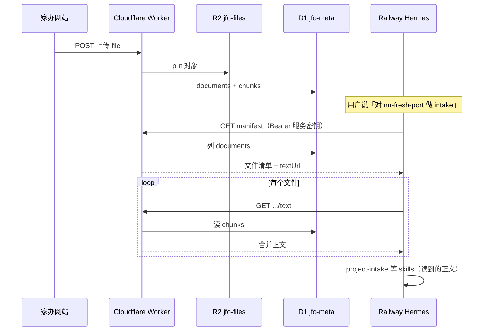

# Hermes 读取网站 R2 资料（层 1）— 接口清单与最小接入

目标：**网站仍是唯一资料库（R2 + D1）**；Hermes **不复制 PDF 到容器**，通过 Worker **只读 API** 拉清单与正文，再跑现有 16 个 skills（**不改**各 skill 正文）。

---

## 架构（层 1）



**不做（层 1）：** 上传/删除时自动触发 Hermes、双向文件镜像。

---

## 环境变量

| 变量 | 设在哪 | 作用 |
|------|--------|------|
| `JFO_INTERNAL_KEY` | Worker `wrangler secret` | Hermes 调 **只读** `/api/hermes/*` 的 Bearer |
| `JFO_API_PUBLIC_BASE` | Worker `[vars]` 可选 | 返回给 Hermes 的绝对 URL 前缀，如 `https://jfo-api.jfo-api.workers.dev` |
| `JFO_API_PUBLIC_BASE` | Hermes Railway Variables | 同上，供 Agent 拼 URL |
| `JFO_INTERNAL_KEY` | Hermes Railway Variables | 与 Worker 完全一致 |

与现有 `HERMES_API_KEY`（网站对话调 Hermes 聊天）**分开**，避免混用。

```bash
# Worker
npx wrangler secret put JFO_INTERNAL_KEY

# wrangler.toml [vars] 示例
# JFO_API_PUBLIC_BASE = "https://jfo-api.jfo-api.workers.dev"
```

---

## Worker 新增 API（建议前缀 `/api/hermes`）

仅 **服务端** 调用；**不** 对浏览器开放 CORS。鉴权：

```http
Authorization: Bearer <JFO_INTERNAL_KEY>
```

所有接口在缺少/错误密钥时返回 `401`。

---

### 1. 健康检查

```http
GET /api/hermes/health
```

**200**

```json
{
  "ok": true,
  "service": "jfo-hermes-bridge",
  "r2Bucket": "jfo-files"
}
```

---

### 2. 项目资料清单（核心）

```http
GET /api/hermes/projects/{projectId}/manifest
```

**Query**

| 参数 | 必填 | 说明 |
|------|------|------|
| `userId` | 否* | `scope=session` 或 `all` 时必填；`scope=package` 时**不需要**（项目资料包按 projectId 共享） |
| `scope` | 否 | `package`（默认，项目资料包）\| `session` \| `all` |
| `conversationId` | 否 | `scope=session` 时过滤 |

\* **intake 推荐**：`GET .../manifest?scope=package` 即可，全项目成员上传的资料都会出现。

**200**

```json
{
  "projectId": "nn-fresh-port",
  "projectName": "南宁东盟生鲜食品智慧港",
  "userId": null,
  "scope": "package",
  "packageScope": "project",
  "syncedAt": "2026-05-22T06:00:00.000Z",
  "files": [
    {
      "documentId": "uuid",
      "filename": "尽调报告二 南宁东盟生鲜食品智慧港.pdf",
      "scope": "package",
      "mime": "application/pdf",
      "createdAt": "2026-05-20T12:00:00.000Z",
      "uploadedBy": "jensen-fang",
      "chunkCount": 42,
      "parsed": true,
      "textUrl": "https://jfo-api.jfo-api.workers.dev/api/hermes/projects/nn-fresh-port/documents/uuid/text",
      "downloadUrl": "https://jfo-api.jfo-api.workers.dev/api/hermes/projects/nn-fresh-port/documents/uuid/download"
    }
  ],
  "instructions": "Hermes：对每个 parsed=true 的文件先 GET textUrl 阅读全文，再执行 project-intake / research。"
}
```

`projectName` 可由 Worker 维护小映射表（`nn-fresh-port` → 中文名），或先返回 `projectId`。

---

### 3. 单文件正文（Hermes 主要用这个）

```http
GET /api/hermes/projects/{projectId}/documents/{documentId}/text
```

**Query：** `userId` 仅当文档为 `scope=session` 时必填；`package` 可省略

**200**

```json
{
  "projectId": "nn-fresh-port",
  "documentId": "uuid",
  "filename": "尽调报告二 南宁东盟生鲜食品智慧港.pdf",
  "mime": "application/pdf",
  "chunkCount": 42,
  "text": "……合并后的全文（与网站 RAG 相同来源）……",
  "truncated": false,
  "maxChars": 500000
}
```

**说明**

- 正文来自 D1 `chunks`，**不必**在 Hermes 里再跑 PDF 解析。
- 若 `parsed=false`，`text` 为占位说明，skill 应标为 Stub/缺乏资料。
- 可设 `maxChars` 上限，超长时 `truncated: true` 并截断（防 token 爆）。

**404** 无此文档；session 文件 `userId` 不匹配时亦 404。

---

### 4. 原始文件下载（可选）

```http
GET /api/hermes/projects/{projectId}/documents/{documentId}/download
```

**Query：** `userId`

**200**：`Content-Type` 为原 mime，body 为 R2 对象字节流。

用于 Excel/Word 等尚未解析的类型；PDF 优先用 `/text`。

---

### 5. 删除同步（层 2 预留，层 1 可不实现）

```http
GET /api/hermes/projects/{projectId}/manifest
```

清单只反映 **当前** D1 状态；网站删文件后需先有 **DELETE 文档 API**（网站侧尚未实现），Hermes 下次拉 manifest 即看不到该文件。

层 1：**删除**仍靠「重新拉 manifest」感知，不做推送。

---

## 与现有公开 API 的关系

| 现有 | Hermes 新接口 |
|------|----------------|
| `GET /api/projects/{id}/files?userId=` | 浏览器用；返回字段较少 |
| `POST /api/projects/{id}/files` | 仅网站上传 |
| `GET /api/hermes/...` | **仅** `JFO_INTERNAL_KEY`，列清单 + 正文 |

实现时复用 `documents` / `chunks` / `FILES.get(r2_key)`，不重复存一份。

---

## Worker 实现顺序（开发 checklist）

1. [ ] `JFO_INTERNAL_KEY` + `verifyHermesAuth(request, env)`
2. [ ] `GET /api/hermes/health`
3. [ ] `GET .../manifest`（`scope=package`，支持 `userId`）
4. [ ] `GET .../documents/{id}/text`（合并 chunks）
5. [ ] `GET .../download`（可选）
6. [ ] `handleHealth` 增加 `hermesBridgeConfigured: Boolean(JFO_INTERNAL_KEY)`
7. [ ] 部署 `wrangler deploy`

---

## Hermes 侧：不动 16 个 skill 的最小改法

### 做法：新增 **1 个** 桥接 skill + **SOUL 一段**

不修改 `opportunistic-investments` 下 16 个 `SKILL.md`。

#### A. 安装桥接 skill

在 Railway（或本机）：

```text
~/.hermes/skills/jfo-r2-materials/SKILL.md
```

内容见本仓库：`hermes-railway/skills/jfo-r2-materials/SKILL.md`（安装时复制即可）。

在 Dashboard → **SKILLS** 启用 `jfo-r2-materials`。

#### B. SOUL / CONFIG 增加（`~/.hermes/SOUL.md` 或 CONFIG 文本框）

```markdown
## 联合家办平台 · 资料来源

当用户提到家办平台项目（projectId 如 nn-fresh-port、shrimp）或「网站上传的资料」时：

1. **禁止**默认「本地项目文件夹」里有 PDF。
2. **必须先**按 skill `jfo-r2-materials` 从 Cloudflare Worker 拉取 manifest 与各文件 text。
3. 再调用 project-intake、public-info-search、knowledge-base-generation 等（用已拉取的正文作为 corpus）。

环境变量：JFO_API_PUBLIC_BASE、JFO_INTERNAL_KEY、JFO_DEFAULT_USER_ID（可选，如 jensen-fang）。
```

#### C. Railway Variables（Hermes）

```bash
JFO_API_PUBLIC_BASE=https://jfo-api.jfo-api.workers.dev
JFO_INTERNAL_KEY=<与 Worker 相同>
JFO_DEFAULT_USER_ID=jensen-fang
```

---

## Hermes 操作话术（复制即用）

### 拉资料 + intake（推荐一句）

```text
请按 jfo-r2-materials：projectId=nn-fresh-port，拉取网站项目资料包全文（scope=package），然后执行 project-intake，生成 [AI] 知识网络 v1。
```

### 仅查看网站有哪些文件

```text
请调用 JFO manifest：projectId=nn-fresh-port，scope=package，列出文件名与是否已解析，不要编造本地文件。
```

### research（公开信息 + 已有正文）

```text
projectId=nn-fresh-port。先 jfo-r2-materials 拉尽调正文，再 public-info-search，再 knowledge-base-generation 更新 KB。
```

---

## 项目 ID 对照（网站 ↔ Hermes 话术）

| projectId | 项目名称 |
|-----------|----------|
| `nn-fresh-port` | 南宁东盟生鲜食品智慧港 |
| `shrimp` | （示例项目，以网站为准） |

完整列表见 `src/workspace/projects.ts`。

---

## 自测（Hermes 未跑 Agent 前）

PowerShell（替换密钥与 projectId）：

```powershell
$base = "https://jfo-api.jfo-api.workers.dev"
$key = "你的JFO_INTERNAL_KEY"
$h = @{ Authorization = "Bearer $key" }

Invoke-RestMethod "$base/api/hermes/health" -Headers $h

Invoke-RestMethod "$base/api/hermes/projects/nn-fresh-port/manifest?scope=package" -Headers $h
```

第二条若 `files` 为空 → 该项目尚未上传项目资料包。

---

## 难度与周期（层 1 only）

| 项 | 估计 |
|----|------|
| Worker 4 个端点 + 鉴权 | 1～2 天 |
| Hermes 桥接 skill + SOUL | 0.5 天 |
| 联调 intake 读尽调 PDF 正文 | 0.5～1 天 |

**总计约 2～4 天**（不含 KB Tab iframe）。

---

## 下一步（不在层 1）

- 网站 **知识网络 Tab**（HTML 在 R2，`GET` + iframe）
- `PUT` KB HTML 回写
- 上传成功 → 异步 `POST /v1/runs`（层 2 自动同步）
- 网站 **删除文件** API + manifest 自动反映
